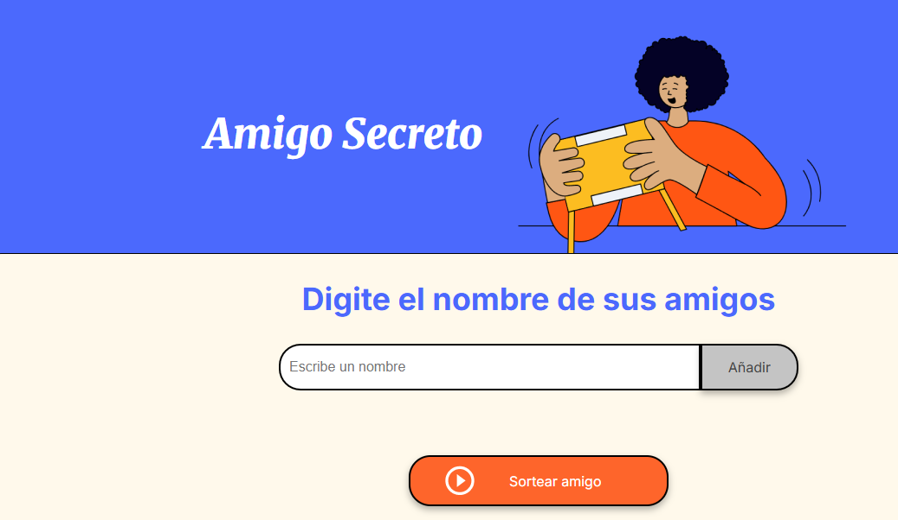
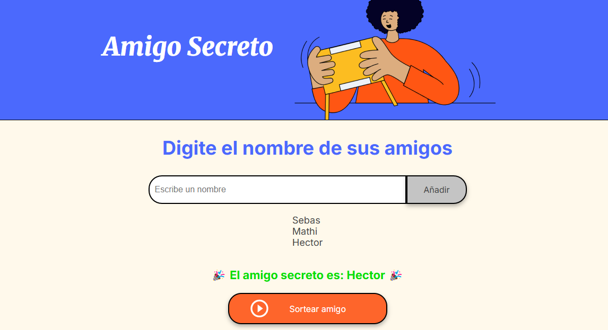

# Amigo Secreto 🎁

Esta es una aplicación web sencilla que permite realizar un sorteo de "Amigo Secreto". Los usuarios pueden ingresar nombres en una lista y luego sortear aleatoriamente a un participante.

## 📌 Funcionalidades
- Agregar nombres a la lista.
- Validar que no se ingresen nombres vacíos o repetidos.
- Mostrar la lista de participantes.
- Sortear un amigo secreto aleatoriamente.

## 🚀 Cómo usar
1. Escribe el nombre de un participante en el campo de entrada.
2. Haz clic en el botón "Añadir" para agregarlo a la lista.
3. Repite el proceso para más participantes.
4. Una vez que haya al menos dos nombres, haz clic en "Sortear Amigo".
5. Se mostrará el nombre del amigo secreto seleccionado al azar.

## 🛠️ Tecnologías utilizadas
- HTML
- CSS
- JavaScript

## 📂 Estructura del proyecto
```
📂 amigo-secreto
├── 📄 index.html  (Interfaz principal)
├── 📄 style.css   (Estilos)
├── 📄 app.js      (Lógica del sorteo)
├── 📂 img         (Carpeta de imágenes)
│   ├── evidencia1.png
│   ├── evidencia2.png
└── 📄 README.md   (Este archivo)
```

## 📸 Interfaces
### 📌 Interfaz principal


### 📌 Resultado del sorteo



